<!-- CONSTELLATION_HEADER -->

  

<!-- /CONSTELLATION_HEADER -->

 

<h1 align="center">🌌 DeepExtrema</h1>

<h3 align="center">🧠 Founder | Builder | Explorer</h3>

  <em>Forward-deployed consciousness. </em>

 
 💫 About Me:
🛠️ I’m currently working on: ARES (2D LiDAR + ML hand-gesture control) + Sherlock (agentic data analysis → report + optional baseline ML models)  🤝 I’m looking to collaborate on: OSS + research-y builds around agentic analytics and robotics perception (NYC in-person preferred, remote OK)  🧠 I’m looking for help with: architecture review + pair programming + tests/evals (reproducible builds only)  🌱 I’m currently learning: LangChain/agent frameworks, LLM systems, JS/TS, ROS2 + Rust  💬 Ask me about: agent orchestration + evals, LiDAR perception/gesture classification, shipping ML systems (FastAPI/Docker/K8s)  ⚡ Fun fact: my favorite game is Terra Invicta

## 🌐 Socials:
   

# 💻 Tech Stack:
                           
# 📊 GitHub Stats:
 
 

### ✍️ Random Dev Quote

---
<!-- SIGNAL_FEED -->

<table>
<tr></tr>
<tr>
<td align="center" width="33%">
 

### 🌌 Space (stale)

 

**Voyager 1**

The most distant human-made object, over 14 billion miles from Earth.

 
 
</td>
<td align="center" width="33%">
 

### 🤖 AI

 

**[huggingface/transformers](https://github.com/huggingface/transformers)**

🤗 Transformers: the model-definition framework for state-...

 
 
</td>
<td align="center" width="33%">
 

### 💬 Phrase

 

> *Build for the timeline you want to live in.*

 
 
</td>
</tr>
</table>

<!-- /SIGNAL_FEED -->

 

 

<!-- SNAKE -->

  <picture>
    <source media="(prefers-color-scheme: dark)" srcset="dist/github-snake-dark.svg" />
    <source media="(prefers-color-scheme: light)" srcset="dist/github-snake.svg" />
    
  </picture>

<!-- /SNAKE -->

 

---

 

  <em>Built with curiosity, powered by code 🌌</em>

 
