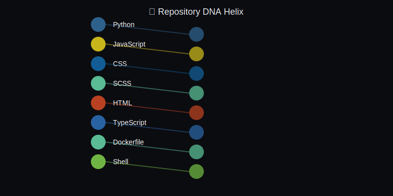
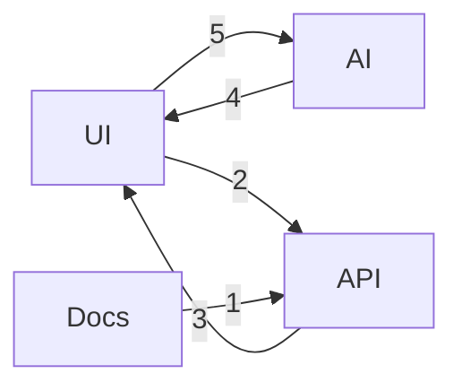

<div align="center">

</div>

# 🌌 DeepExtrema
### 🧠 Founder | Builder | Explorer
> **Forward-deployed consciousness — audacity with instrumentation.**

<div align="center">


</div>

---

## 👤 About Me
I build systems that learn how to solve problems on their own.  
Sometimes they analyze data; sometimes they automate decisions.  
They always start with curiosity and end with receipts.

---

## 🚀 What I'm Working On

<!--START_SECTION:LAUNCH-->
🛰️ **Currently Launching:** Building in stealth mode...

*Auto-detected from recent releases and commits*

<!--END_SECTION:LAUNCH-->

### Deepline
A small company exploring autonomy in data and machine learning systems.  
Depth first; scale later. Fundamentals over theater.

---

## ⚙ Projects

### Sherlock — AI Data Scientist
Investigates datasets like a human analyst: **hypothesize → test → explain**.  
Finds patterns, outliers, and stories; writes it down so decisions aren't vibes.

### Orbital Forge
Autonomous construction drones in low orbit.  
Kept because the frontier should stay on the table.

---

## 📊 Cosmic Dashboard


---

## 📈 Evolution & Trajectory

<!--START_SECTION:EVOLUTION-->
## 📈 Evolution Graph
![Evolution](https://quickchart.io/chart?c=%7B%22type%22%3A%20%22line%22%2C%20%22data%22%3A%20%7B%22labels%22%3A%20%5B%22May%2025%22%2C%20%22Jun%2025%22%2C%20%22Jul%2025%22%2C%20%22Aug%2025%22%2C%20%22Sep%2025%22%2C%20%22Oct%2025%22%5D%2C%20%22datasets%22%3A%20%5B%7B%22label%22%3A%20%22Total%20Stars%22%2C%20%22data%22%3A%20%5B1%2C%201%2C%201%2C%201%2C%201%2C%201%5D%2C%20%22borderColor%22%3A%20%22%236EE7B7%22%2C%20%22backgroundColor%22%3A%20%22rgba%28110%2C%20231%2C%20183%2C%200.1%29%22%2C%20%22fill%22%3A%20true%2C%20%22tension%22%3A%200.4%7D%2C%20%7B%22label%22%3A%20%22Recent%20Commits%22%2C%20%22data%22%3A%20%5B0%2C%200%2C%200%2C%200%2C%200%2C%200%5D%2C%20%22borderColor%22%3A%20%22%233B82F6%22%2C%20%22backgroundColor%22%3A%20%22rgba%2859%2C%20130%2C%20246%2C%200.1%29%22%2C%20%22fill%22%3A%20true%2C%20%22tension%22%3A%200.4%7D%5D%7D%2C%20%22options%22%3A%20%7B%22scales%22%3A%20%7B%22y%22%3A%20%7B%22beginAtZero%22%3A%20true%2C%20%22grid%22%3A%20%7B%22color%22%3A%20%22rgba%28255%2C255%2C255%2C0.1%29%22%7D%7D%2C%20%22x%22%3A%20%7B%22grid%22%3A%20%7B%22display%22%3A%20false%7D%7D%7D%2C%20%22plugins%22%3A%20%7B%22legend%22%3A%20%7B%22position%22%3A%20%22top%22%2C%20%22labels%22%3A%20%7B%22color%22%3A%20%22%23ECEFF4%22%7D%7D%2C%20%22title%22%3A%20%7B%22display%22%3A%20true%2C%20%22text%22%3A%20%22%5Cud83d%5Cudcc8%20Evolution%20Trajectory%22%2C%20%22color%22%3A%20%22%23ECEFF4%22%7D%7D%7D%7D&backgroundColor=rgb(11,11,12)&width=800&height=300)

*Tracking growth across the void*  
*Last updated: 2025-10-28 03:36 UTC*

<!--END_SECTION:EVOLUTION-->

<!--START_SECTION:TRAJECTORY-->
## 🎯 Recent Trajectory
- ⚡ Pushed 0 commits to **deepline-website**
- ⚡ Pushed 0 commits to **deepline-website**
- ⚡ Pushed 0 commits to **deepline-website**
- ⚡ Pushed 0 commits to **deepline-website**
- ⚡ Pushed 0 commits to **deepline-website**

*Last scan: 2025-10-28 03:36 UTC*

<!--END_SECTION:TRAJECTORY-->

---

## 🌊 Activity Analysis

<!--START_SECTION:VELOCITYWAVES-->
### 🌊 Velocity Waves
![Velocity Waves](https://quickchart.io/chart?c=%7B%22type%22%3A%20%22line%22%2C%20%22data%22%3A%20%7B%22labels%22%3A%20%5B%220%3A00%22%2C%20%221%3A00%22%2C%20%222%3A00%22%2C%20%223%3A00%22%2C%20%224%3A00%22%2C%20%225%3A00%22%2C%20%226%3A00%22%2C%20%227%3A00%22%2C%20%228%3A00%22%2C%20%229%3A00%22%2C%20%2210%3A00%22%2C%20%2211%3A00%22%2C%20%2212%3A00%22%2C%20%2213%3A00%22%2C%20%2214%3A00%22%2C%20%2215%3A00%22%2C%20%2216%3A00%22%2C%20%2217%3A00%22%2C%20%2218%3A00%22%2C%20%2219%3A00%22%2C%20%2220%3A00%22%2C%20%2221%3A00%22%2C%20%2222%3A00%22%2C%20%2223%3A00%22%5D%2C%20%22datasets%22%3A%20%5B%7B%22label%22%3A%20%22Commits%22%2C%20%22data%22%3A%20%5B0%2C%201%2C%205%2C%2020%2C%203%2C%206%2C%202%2C%200%2C%201%2C%201%2C%203%2C%200%2C%204%2C%200%2C%203%2C%201%2C%200%2C%200%2C%206%2C%200%2C%200%2C%200%2C%200%2C%200%5D%2C%20%22borderColor%22%3A%20%22%236EE7B7%22%2C%20%22backgroundColor%22%3A%20%22rgba%28110%2C%20231%2C%20183%2C%200.2%29%22%2C%20%22fill%22%3A%20true%2C%20%22tension%22%3A%200.4%2C%20%22pointRadius%22%3A%204%2C%20%22pointBackgroundColor%22%3A%20%22%239333EA%22%7D%5D%7D%2C%20%22options%22%3A%20%7B%22plugins%22%3A%20%7B%22title%22%3A%20%7B%22display%22%3A%20true%2C%20%22text%22%3A%20%22%5Cud83c%5Cudf0a%20Coding%20Velocity%20Waves%20%2824h%29%22%2C%20%22color%22%3A%20%22%23ECEFF4%22%7D%2C%20%22legend%22%3A%20%7B%22labels%22%3A%20%7B%22color%22%3A%20%22%23ECEFF4%22%7D%7D%7D%2C%20%22scales%22%3A%20%7B%22y%22%3A%20%7B%22beginAtZero%22%3A%20true%2C%20%22grid%22%3A%20%7B%22color%22%3A%20%22rgba%28255%2C255%2C255%2C0.1%29%22%7D%7D%2C%20%22x%22%3A%20%7B%22grid%22%3A%20%7B%22display%22%3A%20false%7D%7D%7D%7D%7D&backgroundColor=rgb(11,11,12)&width=800&height=300)

🌙 **Peak Orbit:** 3:00 - 4:00 UTC

*Last updated: 2025-10-28 03:36 UTC*

<!--END_SECTION:VELOCITYWAVES-->

<!--START_SECTION:RADAR-->
### 📡 Signal Strength Radar
&width=600&height=400)

🎯 Overall Signal: **36%**

*Last updated: 2025-10-28 03:37 UTC*

<!--END_SECTION:RADAR-->

---

## 🧬 Technology Stack

<!--START_SECTION:DNAHELIX-->
### 🧬 Repository DNA Helix


> *Genetic code of your technology stack*

<!--END_SECTION:DNAHELIX-->

<!--START_SECTION:THRUSTERS-->
## 🔥 Active Thrusters
*Self-detected tech stack from activity in the last 7 days*

### 👨‍💻 Languages
**Python** `██████░░░░░░░░░░░░░░` 33.0%
**JavaScript** `█████░░░░░░░░░░░░░░░` 28.2%
**CSS** `█████░░░░░░░░░░░░░░░` 27.7%
**HTML** `█░░░░░░░░░░░░░░░░░░░` 8.6%
**TypeScript** `░░░░░░░░░░░░░░░░░░░░` 2.4%

### 🧰 Frameworks & Libraries
`numpy`

### 🗄️ Databases & Cloud
*None detected*

### 💻 Tools & DevOps
`GitHub Actions`

*Last scan: 2025-10-28 03:36 UTC*

<!--END_SECTION:THRUSTERS-->

---

## 🎯 System Status

<!--START_SECTION:MISSIONSUCCESS-->
### 🎯 Mission Success Rate
🟡 **Status:** Minor Issues  
`██████████████████░░` **94%**

✅ Successful: 17 | ❌ Failed: 0 | 📊 Total: 18

*Last check: 2025-10-28 03:37 UTC*

<!--END_SECTION:MISSIONSUCCESS-->

<!--START_SECTION:BATTERY-->
## 🔋 System Energy Level
```
🔴⚪⚪⚪⚪  0% - STANDBY
```
*Measured from activity in the last 7 days*  
*Last check: 2025-10-28 03:36 UTC*

<!--END_SECTION:BATTERY-->

---

## ⚡ Recent Activity

<!--START_SECTION:LIGHTNING-->
### ⚡ Lightning Commits
```
⚡ LIGHTNING COMMIT LOG
03:47:13 → [4f18d2d] ⭐ Update Cosmic Dashboard - 2025-10-27 03:47 UTC
         ↳ deepextrema
03:37:18 → [e9212b2] ⭐ Update Cosmic Dashboard - 2025-10-26 03:37 UTC
         ↳ deepextrema
18:21:24 → [f7aba8d] Add GitHub Actions workflow for Jekyll deployment
         ↳ deepline-website
18:19:54 → [8e4a9f3] Add GitHub Actions workflow for static site deployment
         ↳ deepline-website
18:19:34 → [48d4c8c] removed static.yml file
         ↳ deepline-website
```

*Last updated: 2025-10-28 03:37 UTC*
<!--END_SECTION:LIGHTNING-->

<!--START_SECTION:SHIPLOG-->
## 🛸 Starship Build Log
*Active repositories sorted by recent commits*

🧠 **[deepextrema](https://github.com/DeepExtrema/deepextrema)** — ⭐ Update Cosmic Dashboard - 2025-10-27 03:47 UTC *(today)*
🎨 **[deepline-website](https://github.com/DeepExtrema/deepline-website)** — Add GitHub Actions workflow for Jekyll deployment *(2d ago)*
🧠 **[ChatBot](https://github.com/DeepExtrema/ChatBot)** — Update README.md *(180d ago)*
🧠 **[Langchain_agtent-GHW](https://github.com/DeepExtrema/Langchain_agtent-GHW)** — Initial commit *(13d ago)*
🧪 **[Sherlock-Multiagent-Data-Scientist](https://github.com/DeepExtrema/Sherlock-Multiagent-Data-Scientist)** — Potential fix for code scanning alert no. 5: Information exp *(19d ago)*
🧠 **[Healthboard](https://github.com/DeepExtrema/Healthboard)** — Initial commit *(145d ago)*
🧪 **[RAG_Codebase](https://github.com/DeepExtrema/RAG_Codebase)** — Initial commit *(239d ago)*
🧠 **[Inventory_Tracker](https://github.com/DeepExtrema/Inventory_Tracker)** — made pantry tracker with search bar and Add/Remove button *(448d ago)*
🎨 **[Portfolio-Website](https://github.com/DeepExtrema/Portfolio-Website)** — nothing should have canged here *(453d ago)*

*Last updated: 2025-10-28 03:36 UTC*

<!--END_SECTION:SHIPLOG-->

---

## 🧠 Development Patterns

<!--START_SECTION:NEURAL-->
### 🧠 Neural Pathway Map


*Topic transitions in commit messages (last 60 days)*  
*Last updated: 2025-10-28 03:37 UTC*

<!--END_SECTION:NEURAL-->

---

## 🤖 AI Integrations

<!--START_SECTION:MODEL-->
## 🤖 AI Co-Pilot This Week
**[Whisper](https://github.com/openai/whisper)**  
*Speech recognition that works*

*Rotates weekly • Last updated: 2025-10-28*

<!--END_SECTION:MODEL-->

---

## 🌌 Cosmic Insights

<!--START_SECTION:COSMICFACT-->
## 🌠 Cosmic Fact of the Day
> **Astronomy Picture of the Day**: Ten thousand years ago, before the dawn of recorded human history, a new light would suddenly have appeared in the night sky and faded after a few weeks.

*Last updated: 2025-10-28 03:36 UTC*

<!--END_SECTION:COSMICFACT-->

<!--START_SECTION:QUOTE-->
## 💭 Daily Transmission
> *"Unleash the power of innovation to reach the stars and shape our destiny."*

*Last signal: 2025-10-28 03:36 UTC*

<!--END_SECTION:QUOTE-->

---

### 🌙 Current Moon Phase


---

<div align="center">

</div>

**Built with curiosity, powered by code** 🌌
