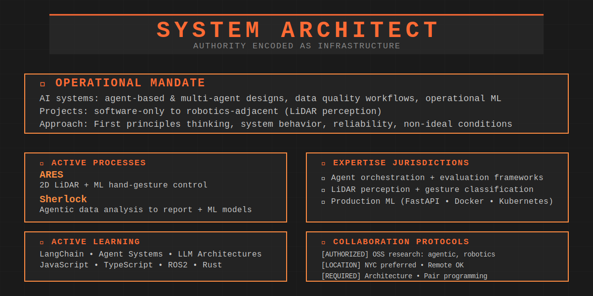
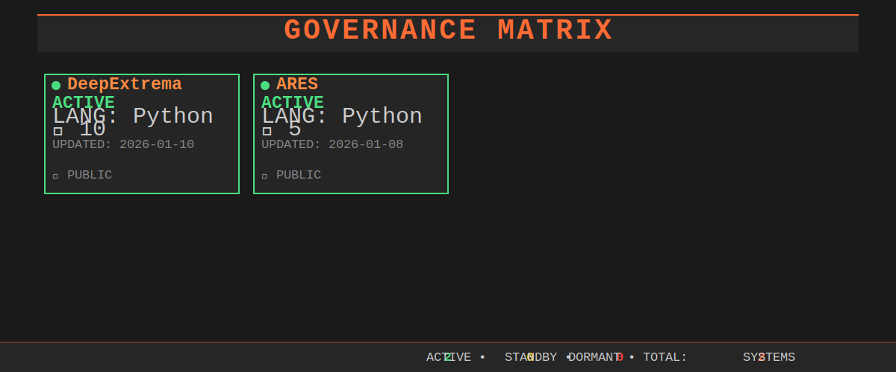
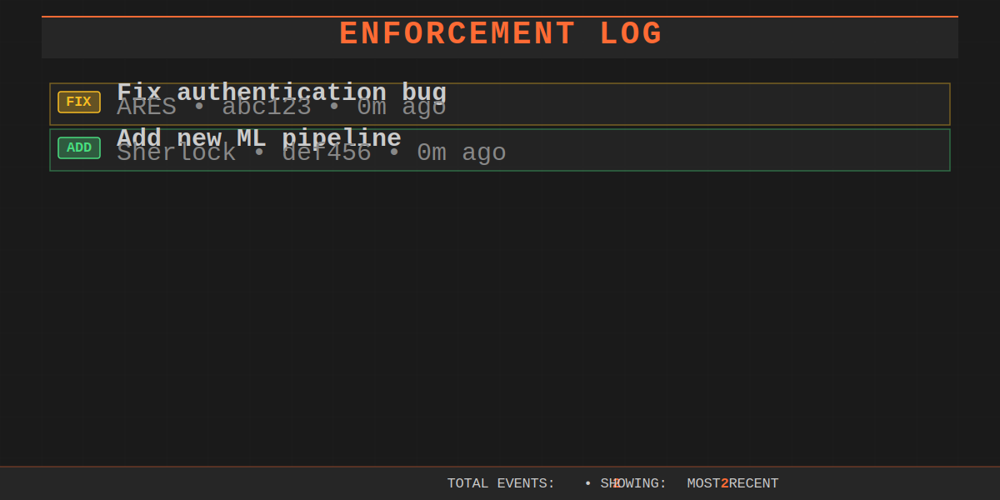
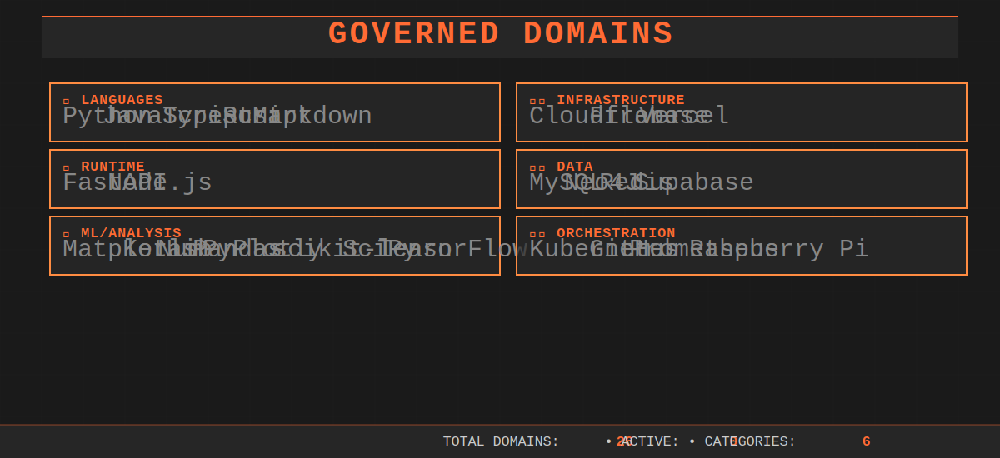
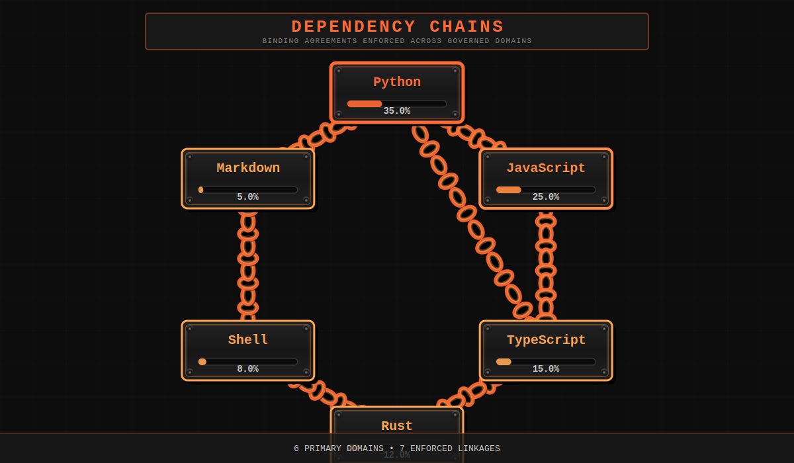

<!-- NEON_HEADER -->

  

<!-- /NEON_HEADER -->

 

<!-- SYSTEM_AUTHORITY -->

  

<!-- /SYSTEM_AUTHORITY -->

 

---

 

<!-- GOVERNANCE_MATRIX -->
## ⚙️ GOVERNANCE MATRIX

*Access control status and authorization levels across governed systems*

  

<!-- /GOVERNANCE_MATRIX -->

 

---

 

<!-- ENFORCEMENT_LOG -->
## 🔗 ENFORCEMENT LOG

*Recent authorization events and system modifications*

  

<!-- /ENFORCEMENT_LOG -->

 

---

 

<!-- TECH_JURISDICTION -->
## ⚡ GOVERNED DOMAINS

*Technologies under system authority*

  

<!-- /TECH_JURISDICTION -->

 

---

 

<!-- DEPENDENCY_CHAINS -->
## 🔗 DEPENDENCY CHAINS

*Binding agreements and enforced linkages across systems*

  

<!-- /DEPENDENCY_CHAINS -->

 

---

 

<!-- ACTIVITY_CIRCUIT -->
## ⚙️ ACTIVITY CIRCUIT

*Policy encoded as logic - contribution patterns and enforcement history*

  <picture>
    <source media="(prefers-color-scheme: dark)" srcset="assets/circuit_dark.svg" />
    <source media="(prefers-color-scheme: light)" srcset="assets/circuit_light.svg" />
    
  </picture>

<!-- /ACTIVITY_CIRCUIT -->

 

---

 

<!-- SYSTEM_METRICS -->
## 📊 SYSTEM METRICS

*Quantified authority and operational statistics*

<!-- /SYSTEM_METRICS -->

 

---

 

<!-- AUTHORIZATION_CHANNELS -->
## 📡 AUTHORIZATION CHANNELS

*Contact protocols for system access requests*

  

<!-- /AUTHORIZATION_CHANNELS -->

 

---

 

*Power is embedded, not wielded. Control is infrastructural, not visible.*

**SYSTEM STATUS:** `OPERATIONAL`

 
