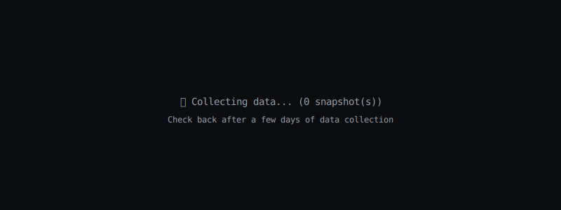

<!-- CONSTELLATION_HEADER -->
<div align="center">
  
</div>
<!-- /CONSTELLATION_HEADER -->

<br>

<h1 align="center">🌌 DeepExtrema</h1>

<h3 align="center">🧠 Founder | Builder | Explorer</h3>

<p align="center">
  <em>Forward-deployed consciousness — audacity with instrumentation.</em>
</p>

<br>

<!-- SYSTEMS_HEALTH -->
<div align="center">
  <code>Systems: ⚠️ Check Failed | Last Sync: 2025-12-28 01:10 UTC | Error: 403 {"message": "Resource not </code>
</div>
<!-- /SYSTEMS_HEALTH -->

<br>
<br>

---

<br>

## 🚀 Ship Log

<br>

<!-- SHIP_LOG -->
### 🎯 Currently Shipping

<br>

> *No active shipping targets detected*

<br>

### 📋 Recent Work Log

<br>

> *No recent activity to display*

<br>

### 🔥 Active Fronts

<br>

> *Scanning for activity...*

<br>

<!-- /SHIP_LOG -->

---

<br>

## 📊 Flight Telemetry

<br>

<!-- FLIGHT_TELEMETRY -->

<table>
<tr></tr>
<tr>
<td align="center" width="33%">
<br>

### 🛸 Activity Orbit

<br>

```
Commits (14d): ░░░░░░░░░░ 0
Active Days:   0 / 14
```

<br>
</td>
<td align="center" width="33%">
<br>

### ⚡ Velocity

<br>

```
PRs Merged (7d):    0
Issues Closed (7d): 0
Trend: → Steady
```

<br>
</td>
<td align="center" width="33%">
<br>

### 📦 Load

<br>

```
Open Issues: 0
Open PRs:    0
```

<br>
</td>
</tr>
<tr></tr>
<tr>
<td align="center" colspan="2">
<br>

### 🔧 Thrusters Engaged

<br>

*Scanning tech stack...*

<br>
</td>
<td align="center">
<br>

### 📈 Momentum

<br>

```
Score: 0
```

<sub>commits×1 + PRs×5 + repos×2</sub>

<br>
</td>
</tr>
</table>

<!-- /FLIGHT_TELEMETRY -->

<br>

---

<br>

## 📈 Evolution Map

<br>

<!-- EVOLUTION_MAP -->
<div align="center">
  
</div>

<div align="center">
  <em>90-day trajectory • Updated 2025-12-28 • 0 snapshots</em>
</div>
<!-- /EVOLUTION_MAP -->

<br>

---

<br>

## 📡 Signal Feed

<br>

<!-- SIGNAL_FEED -->

<table>
<tr></tr>
<tr>
<td align="center" width="33%">
<br>

### 🌌 Space (stale)

<br>

**Neutron Stars**

A teaspoon of neutron star material weighs about 6 billion tons.

<br>
<br>
</td>
<td align="center" width="33%">
<br>

### 🤖 AI

<br>

**[pytorch/pytorch](https://github.com/pytorch/pytorch)**

Tensors and Dynamic neural networks in Python with strong...

<br>
<br>
</td>
<td align="center" width="33%">
<br>

### 💬 Phrase

<br>

> *The frontier rewards those who show up.*

<br>
<br>
</td>
</tr>
</table>

<!-- /SIGNAL_FEED -->

<br>

---

<br>

<!-- DNA_HELIX -->
<div align="center">
  
</div>
<!-- /DNA_HELIX -->

<br>

---

<br>

<!-- SNAKE -->
<div align="center">
  <picture>
    <source media="(prefers-color-scheme: dark)" srcset="dist/github-snake-dark.svg" />
    <source media="(prefers-color-scheme: light)" srcset="dist/github-snake.svg" />
    
  </picture>
</div>
<!-- /SNAKE -->

<br>

---

<br>

<p align="center">
  <em>Built with curiosity, powered by code 🌌</em>
</p>

<br>
