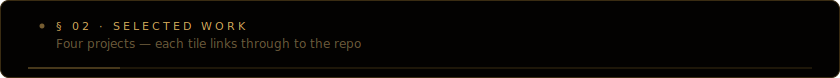
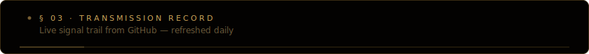
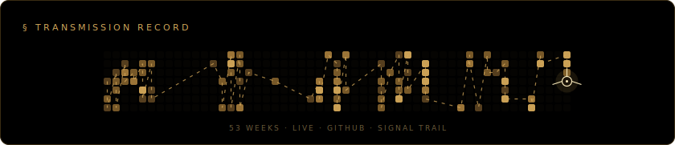
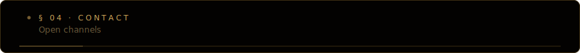

<!-- § 01 · Identity -->

  

  

<!-- § 02 · Selected work -->

 

<table border="0" cellspacing="12" cellpadding="0"><tr>
<td></td>
<td></td>
</tr><tr>
<td></td>
<td></td>
</tr></table>

  

<!-- § 03 · Transmission record -->

 

  

<!-- § 04 · Contact -->

 

&nbsp;

&nbsp;

  

