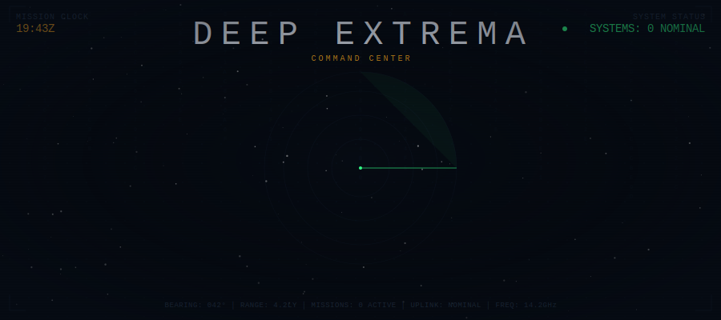
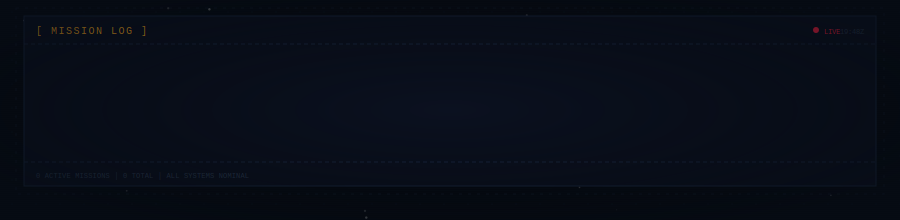
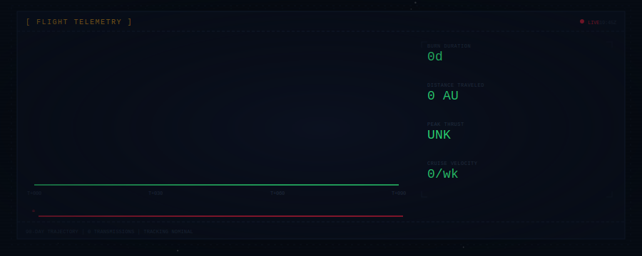
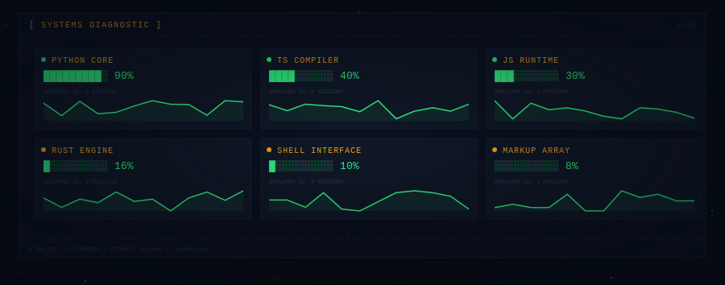
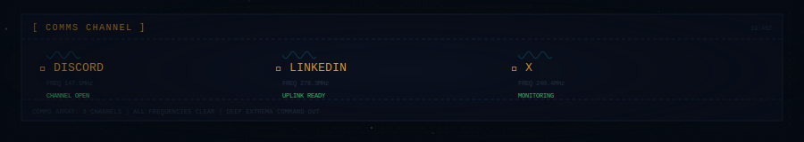

<!-- COMMAND_HEADER -->

  <picture>
    <source media="(prefers-color-scheme: dark)" srcset="assets/command_header_dark.svg" />
    <source media="(prefers-color-scheme: light)" srcset="assets/command_header_light.svg" />
    
  </picture>

<!-- /COMMAND_HEADER -->

 

<!-- MISSION_LOG -->

  <picture>
    <source media="(prefers-color-scheme: dark)" srcset="assets/mission_log_dark.svg" />
    <source media="(prefers-color-scheme: light)" srcset="assets/mission_log_light.svg" />
    
  </picture>

<!-- /MISSION_LOG -->

 

<!-- FLIGHT_TELEMETRY -->

  <picture>
    <source media="(prefers-color-scheme: dark)" srcset="assets/flight_telemetry_dark.svg" />
    <source media="(prefers-color-scheme: light)" srcset="assets/flight_telemetry_light.svg" />
    
  </picture>

<!-- /FLIGHT_TELEMETRY -->

 

<!-- SYSTEMS_DIAGNOSTIC -->

  <picture>
    <source media="(prefers-color-scheme: dark)" srcset="assets/systems_diagnostic_dark.svg" />
    <source media="(prefers-color-scheme: light)" srcset="assets/systems_diagnostic_light.svg" />
    
  </picture>

<!-- /SYSTEMS_DIAGNOSTIC -->

 

<!-- COMMS_CHANNEL -->

  <picture>
    <source media="(prefers-color-scheme: dark)" srcset="assets/comms_channel_dark.svg" />
    <source media="(prefers-color-scheme: light)" srcset="assets/comms_channel_light.svg" />
    
  </picture>

<!-- /COMMS_CHANNEL -->

 

  <code>◉ SYSTEM STATUS: OPERATIONAL ── ALL MISSIONS NOMINAL ── DEEP EXTREMA COMMAND</code>

