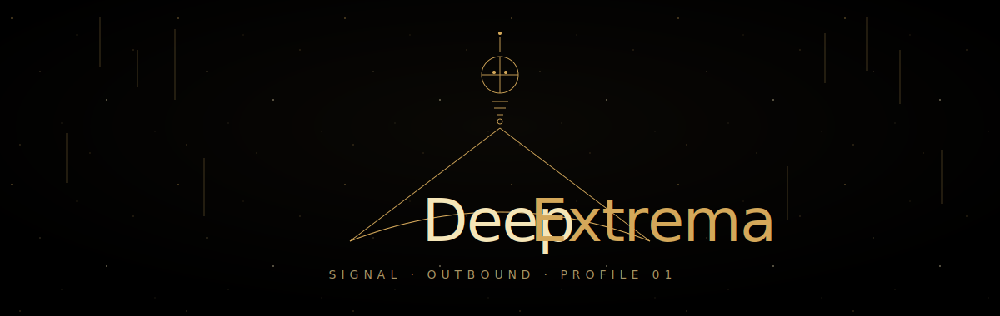
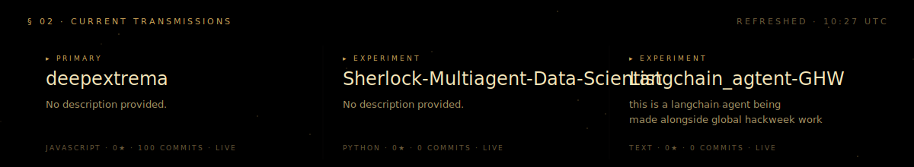
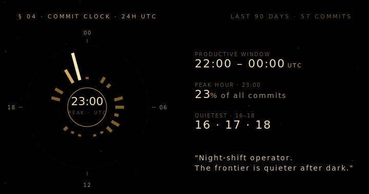
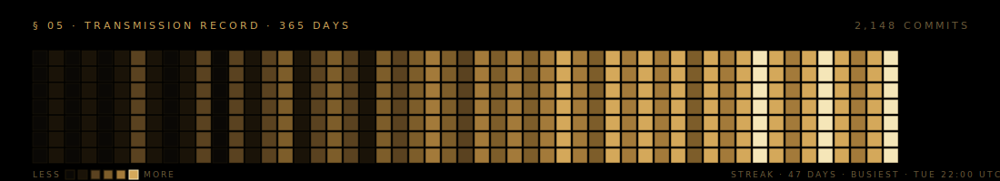
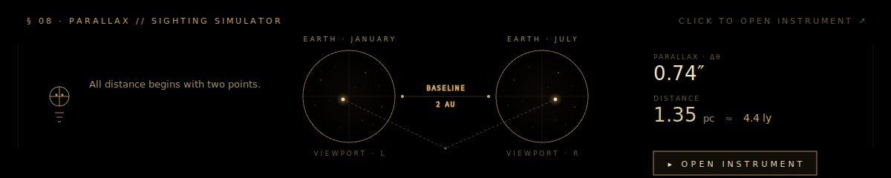

<!--
  ============================================================
  DEEPEXTREMA · OPERATOR PROFILE
  Auto-updated every 6h by .github/workflows/update-cockpit.yml
  Do not hand-edit content between START/END markers.
  Voyager golden record aesthetic — pure black, soft gold.
  ============================================================
-->

<!-- HEADER_START -->
<picture>
  <source media="(prefers-color-scheme: dark)"  srcset="readme-assets/header.svg">
  <source media="(prefers-color-scheme: light)" srcset="readme-assets/header.svg">
  
</picture>
<!-- HEADER_END -->

<!-- LEDE_START -->

> *Building autonomous systems for the deep frontier — orbital tooling, ML pipelines, signal infrastructure. Forward-deployed consciousness.*

<!-- LEDE_END -->

`STATUS · OPERATIONAL`  `SECTOR · ORBITAL TOOLING`  `TZ · UTC+02:00`  `SINCE · 2021`  `LAST SYNC · 06H AGO`

[**GitHub**](https://github.com/DeepExtrema)  ·  [**Site**](https://deepextrema.dev)  ·  [**Email**](mailto:hi@deepextrema.dev)  ·  [**X / Twitter**](https://x.com/deepextrema)

  

<!-- TELEMETRY_START -->

<b>TELEMETRY ·</b>
COMMITS·30D <code>42</code>  ·
PR·MERGED <code>0</code>  ·
ISSUES·CLOSED <code>0</code>  ·
ACTIVE·REPOS <code>3</code>  ·
STARS·TOTAL <code>6</code>  ·
WORKFLOWS <code>⏳✅✅✅✅✅✅✅✅✅</code>  ·
RATE·LIMIT <code>4979/5000</code>

<!-- TELEMETRY_END -->

 

## § 02 · Current transmissions

<!-- CURRENT_FOCUS_START -->

  

<!-- CURRENT_FOCUS_END -->

 

## § 03 · Project timeline

<!-- TIMELINE_START -->

  

<!-- TIMELINE_END -->

 

## § 04 · Commit clock

<!-- CLOCK_START -->

  

<!-- CLOCK_END -->

 

## § 05 · Transmission record

<!-- HEATMAP_START -->

  

<picture>
  <source media="(prefers-color-scheme: dark)"  srcset="dist/github-snake-dark.svg">
  
</picture>
<!-- HEATMAP_END -->

 

## § 06 · Operating stack

<!-- The Voyager record carried gold, copper, and 116 images.
     This one carries five languages and a strong opinion. -->

| | | |
|---|---|---|
| **Languages**  | Python 3.11 · TypeScript · Rust · Go · ROS 2 | *what I write* |
| **ML / Data**  | PyTorch · NumPy · Polars · DuckDB · TFDV       | *what I train* |
| **Robotics**   | 2D LiDAR · OpenCV · ROS 2 · Raspberry Pi       | *what I ship to physical things* |
| **Infra**      | Docker · GitHub Actions · FastAPI · Postgres   | *what runs at 3am* |
| **Craft**      | Vim · tmux · zsh · Linear · Obsidian           | *how I think* |

 

## § 07 · Signal feed

<!-- SIGNAL_FEED_START -->
<table>
<tr>
<td width="33%" align="center" valign="top">

**🜨 SPACE** (stale)

The Eagle Nebula and Friends — What looks as if it is going to swallow the great Pillars of Creation? The Ea...

NASA APOD · 2026-06-10

</td>
<td width="33%" align="center" valign="top">

**◇ AI**

[huggingface/transformers](https://github.com/huggingface/transformers)

HF TRENDING · 🤗 TRANSFORMERS: THE MODEL-DEFINITION FRAMEWORK FOR STATE...

</td>
<td width="33%" align="center" valign="top">

**✺ PHRASE**

> *Depth first; scale later.*

CURATED · DAILY

</td>
</tr>
</table>
<!-- SIGNAL_FEED_END -->

 

## § 08 · Parallax sighting

<!-- PARALLAX_START -->

  

A small in-browser instrument. Two viewports six months apart — find the star that has shifted, sight it in both, measure the parallax angle.

<!-- PARALLAX_END -->

 

  

<!-- FOOTER_START -->

LAST BUILD <code>2026-06-10 09:48 UTC</code>  ·  NEXT SYNC <code>+6h</code>  ·  WORKFLOW <code>update-cockpit.yml ✓</code>  ·  COMMIT <code>d834a1b</code>

<!-- FOOTER_END -->
