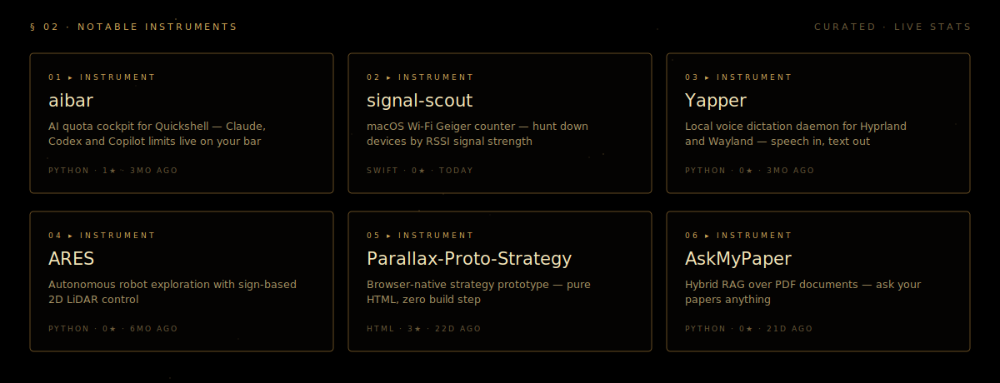
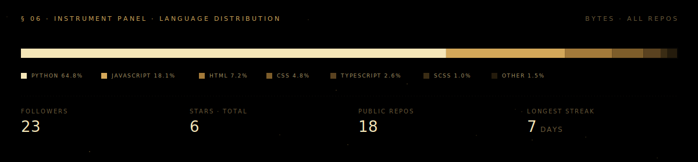
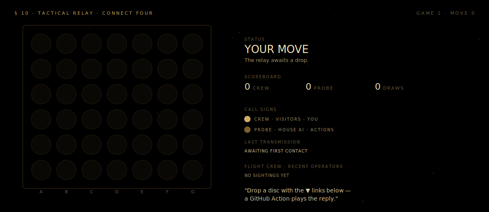

<!--
  ============================================================
  DEEPEXTREMA · OPERATOR PROFILE
  Auto-updated by .github/workflows/ —
    update-cockpit.yml (6h) · update-instruments.yml (daily)
    connect-four.yml (on issue) · deploy-pages.yml (on push)
  Do not hand-edit content between START/END markers.
  Voyager golden record aesthetic — pure black, soft gold.
  ============================================================
-->

<!-- HEADER_START -->
<picture>
  <source media="(prefers-color-scheme: dark)"  srcset="readme-assets/header.svg">
  <source media="(prefers-color-scheme: light)" srcset="readme-assets/header.svg">
  
</picture>
<!-- HEADER_END -->

<!-- LEDE_START -->

> *Building autonomous systems for the deep frontier — orbital tooling, ML pipelines, signal infrastructure. Forward-deployed consciousness.*

<!-- LEDE_END -->

`STATUS · OPERATIONAL`  `SECTOR · ORBITAL TOOLING`  `TZ · UTC+02:00`  `SINCE · 2021`  `LAST SYNC · 06H AGO`

[**GitHub**](https://github.com/DeepExtrema)  ·  [**Site**](https://deepextrema.dev)  ·  [**Email**](mailto:hi@deepextrema.dev)  ·  [**X / Twitter**](https://x.com/deepextrema)

  

<!-- TELEMETRY_START -->

<b>TELEMETRY ·</b>
COMMITS·30D <code>41</code>  ·
PR·MERGED <code>0</code>  ·
ISSUES·CLOSED <code>0</code>  ·
ACTIVE·REPOS <code>3</code>  ·
STARS·TOTAL <code>6</code>  ·
WORKFLOWS <code>⏳✅✅✅✅✅✅✅✅✅</code>  ·
RATE·LIMIT <code>4993/5000</code>

<!-- TELEMETRY_END -->

 

## § 01 · Current transmissions

<!-- CURRENT_FOCUS_START -->

  

<!-- CURRENT_FOCUS_END -->

 

## § 02 · Notable instruments

<!-- FEATURED_START -->

  

OPEN AN INSTRUMENT · [aibar](https://github.com/DeepExtrema/aibar)  ·  [signal-scout](https://github.com/DeepExtrema/signal-scout)  ·  [Yapper](https://github.com/DeepExtrema/Yapper)  ·  [ARES](https://github.com/DeepExtrema/ARES)  ·  [Parallax-Proto-Strategy](https://github.com/DeepExtrema/Parallax-Proto-Strategy)  ·  [AskMyPaper](https://github.com/DeepExtrema/AskMyPaper)

<!-- FEATURED_END -->

 

## § 03 · Project timeline

<!-- TIMELINE_START -->

  

<!-- TIMELINE_END -->

 

## § 04 · Commit clock

<!-- CLOCK_START -->

  

<!-- CLOCK_END -->

 

## § 05 · Transmission record

<!-- HEATMAP_START -->

  

<picture>
  <source media="(prefers-color-scheme: dark)"  srcset="dist/github-snake-dark.svg">
  
</picture>
<!-- HEATMAP_END -->

 

## § 06 · Instrument panel

<!-- INSTRUMENTS_START -->

  

<!-- INSTRUMENTS_END -->

 

## § 07 · Operating stack

<!-- The Voyager record carried gold, copper, and 116 images.
     This one carries five languages and a strong opinion. -->

| | | |
|---|---|---|
| **Languages**  | Python 3.11 · TypeScript · Rust · Go · ROS 2 | *what I write* |
| **ML / Data**  | PyTorch · NumPy · Polars · DuckDB · TFDV       | *what I train* |
| **Robotics**   | 2D LiDAR · OpenCV · ROS 2 · Raspberry Pi       | *what I ship to physical things* |
| **Infra**      | Docker · GitHub Actions · FastAPI · Postgres   | *what runs at 3am* |
| **Craft**      | Vim · tmux · zsh · Linear · Obsidian           | *how I think* |

 

## § 08 · Signal feed

<!-- SIGNAL_FEED_START -->
<table>
<tr>
<td width="33%" align="center" valign="top">

**🜨 SPACE** (stale)

Venus and Jupiter: Conjunction from Avebury — To see Venus and Jupiter together this month, you won't need binoculars or ev...

NASA APOD · 2026-06-12

</td>
<td width="33%" align="center" valign="top">

**◇ AI**

[tensorflow/tensorflow](https://github.com/tensorflow/tensorflow)

HF TRENDING · AN OPEN SOURCE MACHINE LEARNING FRAMEWORK FOR EVERYONE

</td>
<td width="33%" align="center" valign="top">

**✺ PHRASE**

> *Curiosity compounds like interest, but pays in discoveries.*

CURATED · DAILY

</td>
</tr>
</table>
<!-- SIGNAL_FEED_END -->

 

## § 09 · Parallax sighting

<!-- PARALLAX_START -->

  

A small in-browser instrument. Two viewports six months apart — find the star that has shifted, sight it in both, measure the parallax angle.

<!-- PARALLAX_END -->

 

## § 10 · Tactical relay

<!-- CONNECT4_START -->

  

**DROP A DISC**  ·  [▼ A](https://github.com/DeepExtrema/deepextrema/issues/new?title=c4%7Cdrop%7CA&body=Drop%20a%20gold%20disc%20into%20column%20A%20of%20the%20tactical%20relay.%0A%0AJust%20press%20**Create**%20below%20%E2%80%94%20voyager-bot%20will%20make%20your%20move%2C%20answer%20with%20its%20own%2C%20update%20the%20board%20on%20the%20profile%2C%20and%20close%20this%20issue%20automatically.)  ·  [▼ B](https://github.com/DeepExtrema/deepextrema/issues/new?title=c4%7Cdrop%7CB&body=Drop%20a%20gold%20disc%20into%20column%20B%20of%20the%20tactical%20relay.%0A%0AJust%20press%20**Create**%20below%20%E2%80%94%20voyager-bot%20will%20make%20your%20move%2C%20answer%20with%20its%20own%2C%20update%20the%20board%20on%20the%20profile%2C%20and%20close%20this%20issue%20automatically.)  ·  [▼ C](https://github.com/DeepExtrema/deepextrema/issues/new?title=c4%7Cdrop%7CC&body=Drop%20a%20gold%20disc%20into%20column%20C%20of%20the%20tactical%20relay.%0A%0AJust%20press%20**Create**%20below%20%E2%80%94%20voyager-bot%20will%20make%20your%20move%2C%20answer%20with%20its%20own%2C%20update%20the%20board%20on%20the%20profile%2C%20and%20close%20this%20issue%20automatically.)  ·  [▼ D](https://github.com/DeepExtrema/deepextrema/issues/new?title=c4%7Cdrop%7CD&body=Drop%20a%20gold%20disc%20into%20column%20D%20of%20the%20tactical%20relay.%0A%0AJust%20press%20**Create**%20below%20%E2%80%94%20voyager-bot%20will%20make%20your%20move%2C%20answer%20with%20its%20own%2C%20update%20the%20board%20on%20the%20profile%2C%20and%20close%20this%20issue%20automatically.)  ·  [▼ E](https://github.com/DeepExtrema/deepextrema/issues/new?title=c4%7Cdrop%7CE&body=Drop%20a%20gold%20disc%20into%20column%20E%20of%20the%20tactical%20relay.%0A%0AJust%20press%20**Create**%20below%20%E2%80%94%20voyager-bot%20will%20make%20your%20move%2C%20answer%20with%20its%20own%2C%20update%20the%20board%20on%20the%20profile%2C%20and%20close%20this%20issue%20automatically.)  ·  [▼ F](https://github.com/DeepExtrema/deepextrema/issues/new?title=c4%7Cdrop%7CF&body=Drop%20a%20gold%20disc%20into%20column%20F%20of%20the%20tactical%20relay.%0A%0AJust%20press%20**Create**%20below%20%E2%80%94%20voyager-bot%20will%20make%20your%20move%2C%20answer%20with%20its%20own%2C%20update%20the%20board%20on%20the%20profile%2C%20and%20close%20this%20issue%20automatically.)  ·  [▼ G](https://github.com/DeepExtrema/deepextrema/issues/new?title=c4%7Cdrop%7CG&body=Drop%20a%20gold%20disc%20into%20column%20G%20of%20the%20tactical%20relay.%0A%0AJust%20press%20**Create**%20below%20%E2%80%94%20voyager-bot%20will%20make%20your%20move%2C%20answer%20with%20its%20own%2C%20update%20the%20board%20on%20the%20profile%2C%20and%20close%20this%20issue%20automatically.)

FLIGHT CREW · BE THE FIRST TO TRANSMIT

<i>Opening an issue makes your move. The probe answers within a minute. No login tricks — just GitHub.</i>

<!-- CONNECT4_END -->

 

  

<!-- FOOTER_START -->

LAST BUILD <code>2026-06-12 20:03 UTC</code>  ·  NEXT SYNC <code>+6h</code>  ·  WORKFLOW <code>update-cockpit.yml ✓</code>  ·  COMMIT <code>e50ad03</code>

<!-- FOOTER_END -->
