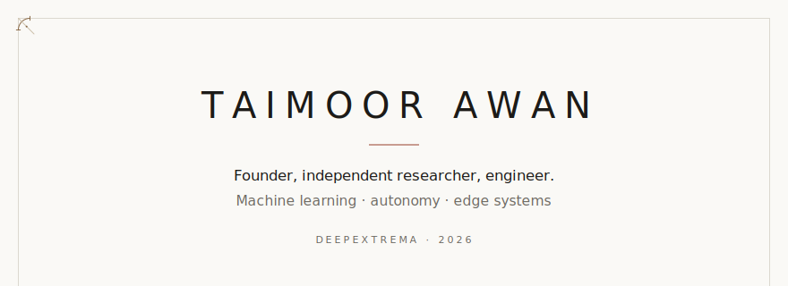
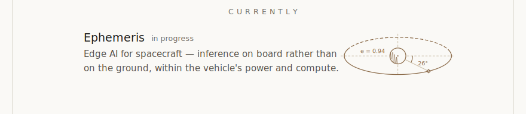
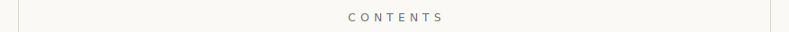
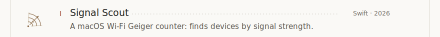
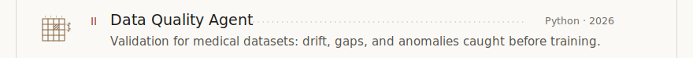
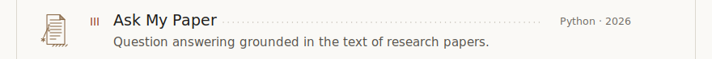
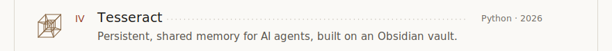
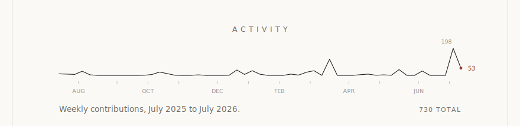
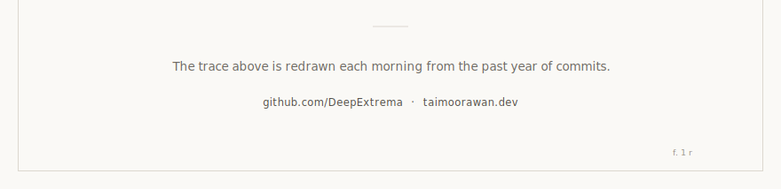

<a href="https://taimoorawan.dev"><picture><source media="(prefers-color-scheme: dark)" srcset="assets/codex-head-dark.svg"></picture></a>
<a href="https://parallex-website.parallex-websitecom.workers.dev/"><picture><source media="(prefers-color-scheme: dark)" srcset="assets/codex-now-dark.svg"></picture></a>
<picture><source media="(prefers-color-scheme: dark)" srcset="assets/codex-contents-dark.svg"></picture>
<a href="https://github.com/DeepExtrema/signal-scout"><picture><source media="(prefers-color-scheme: dark)" srcset="assets/codex-work-1-dark.svg"></picture></a>
<a href="https://github.com/DeepExtrema/DataQualityValidationAgentMedicalData"><picture><source media="(prefers-color-scheme: dark)" srcset="assets/codex-work-2-dark.svg"></picture></a>
<a href="https://github.com/DeepExtrema/AskMyPaper"><picture><source media="(prefers-color-scheme: dark)" srcset="assets/codex-work-3-dark.svg"></picture></a>
<a href="https://github.com/DeepExtrema/tesseract-mcp"><picture><source media="(prefers-color-scheme: dark)" srcset="assets/codex-work-4-dark.svg"></picture></a>
<a href="https://github.com/DeepExtrema"><picture><source media="(prefers-color-scheme: dark)" srcset="assets/codex-activity-dark.svg"></picture></a>
<picture><source media="(prefers-color-scheme: dark)" srcset="assets/codex-foot-dark.svg"></picture>

