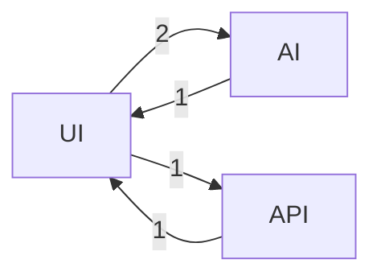

<div align="center">

</div>

# 🌌 DeepExtrema
### 🧠 Founder | Builder | Explorer
> **Forward-deployed consciousness — audacity with instrumentation.**

<div align="center">


</div>

---

## 👤 About Me
I build systems that learn how to solve problems on their own.  
Sometimes they analyze data; sometimes they automate decisions.  
They always start with curiosity and end with receipts.

---

## 🚀 What I'm Working On

<!--START_SECTION:LAUNCH-->
🛰️ **Currently Launching:** Building in stealth mode...

*Auto-detected from recent releases and commits*

<!--END_SECTION:LAUNCH-->

### Deepline
A small company exploring autonomy in data and machine learning systems.  
Depth first; scale later. Fundamentals over theater.

---

## ⚙ Projects

### Sherlock — AI Data Scientist
Investigates datasets like a human analyst: **hypothesize → test → explain**.  
Finds patterns, outliers, and stories; writes it down so decisions aren't vibes.

### Orbital Forge
Autonomous construction drones in low orbit.  
Kept because the frontier should stay on the table.

---

## 📊 Cosmic Dashboard


---

## 📈 Evolution & Trajectory

<!--START_SECTION:EVOLUTION-->
## 📈 Evolution Graph
![Evolution](https://quickchart.io/chart?c=%7B%22type%22%3A%20%22line%22%2C%20%22data%22%3A%20%7B%22labels%22%3A%20%5B%22Jul%2025%22%2C%20%22Aug%2025%22%2C%20%22Sep%2025%22%2C%20%22Oct%2025%22%2C%20%22Nov%2025%22%2C%20%22Dec%2025%22%5D%2C%20%22datasets%22%3A%20%5B%7B%22label%22%3A%20%22Total%20Stars%22%2C%20%22data%22%3A%20%5B1%2C%201%2C%201%2C%201%2C%201%2C%201%5D%2C%20%22borderColor%22%3A%20%22%236EE7B7%22%2C%20%22backgroundColor%22%3A%20%22rgba%28110%2C%20231%2C%20183%2C%200.1%29%22%2C%20%22fill%22%3A%20true%2C%20%22tension%22%3A%200.4%7D%2C%20%7B%22label%22%3A%20%22Recent%20Commits%22%2C%20%22data%22%3A%20%5B0%2C%200%2C%200%2C%200%2C%200%2C%200%5D%2C%20%22borderColor%22%3A%20%22%233B82F6%22%2C%20%22backgroundColor%22%3A%20%22rgba%2859%2C%20130%2C%20246%2C%200.1%29%22%2C%20%22fill%22%3A%20true%2C%20%22tension%22%3A%200.4%7D%5D%7D%2C%20%22options%22%3A%20%7B%22scales%22%3A%20%7B%22y%22%3A%20%7B%22beginAtZero%22%3A%20true%2C%20%22grid%22%3A%20%7B%22color%22%3A%20%22rgba%28255%2C255%2C255%2C0.1%29%22%7D%7D%2C%20%22x%22%3A%20%7B%22grid%22%3A%20%7B%22display%22%3A%20false%7D%7D%7D%2C%20%22plugins%22%3A%20%7B%22legend%22%3A%20%7B%22position%22%3A%20%22top%22%2C%20%22labels%22%3A%20%7B%22color%22%3A%20%22%23ECEFF4%22%7D%7D%2C%20%22title%22%3A%20%7B%22display%22%3A%20true%2C%20%22text%22%3A%20%22%5Cud83d%5Cudcc8%20Evolution%20Trajectory%22%2C%20%22color%22%3A%20%22%23ECEFF4%22%7D%7D%7D%7D&backgroundColor=rgb(11,11,12)&width=800&height=300)

*Tracking growth across the void*  
*Last updated: 2025-12-15 04:00 UTC*

<!--END_SECTION:EVOLUTION-->

<!--START_SECTION:TRAJECTORY-->
## 🎯 Recent Trajectory
- 🔭 Observing the cosmos...

*Last scan: 2025-12-15 04:00 UTC*

<!--END_SECTION:TRAJECTORY-->

---

## 🌊 Activity Analysis

<!--START_SECTION:VELOCITYWAVES-->
### 🌊 Velocity Waves
![Velocity Waves](https://quickchart.io/chart?c=%7B%22type%22%3A%20%22line%22%2C%20%22data%22%3A%20%7B%22labels%22%3A%20%5B%220%3A00%22%2C%20%221%3A00%22%2C%20%222%3A00%22%2C%20%223%3A00%22%2C%20%224%3A00%22%2C%20%225%3A00%22%2C%20%226%3A00%22%2C%20%227%3A00%22%2C%20%228%3A00%22%2C%20%229%3A00%22%2C%20%2210%3A00%22%2C%20%2211%3A00%22%2C%20%2212%3A00%22%2C%20%2213%3A00%22%2C%20%2214%3A00%22%2C%20%2215%3A00%22%2C%20%2216%3A00%22%2C%20%2217%3A00%22%2C%20%2218%3A00%22%2C%20%2219%3A00%22%2C%20%2220%3A00%22%2C%20%2221%3A00%22%2C%20%2222%3A00%22%2C%20%2223%3A00%22%5D%2C%20%22datasets%22%3A%20%5B%7B%22label%22%3A%20%22Commits%22%2C%20%22data%22%3A%20%5B0%2C%200%2C%200%2C%2028%2C%201%2C%200%2C%200%2C%202%2C%200%2C%201%2C%200%2C%200%2C%200%2C%200%2C%200%2C%200%2C%200%2C%200%2C%200%2C%200%2C%200%2C%200%2C%200%2C%200%5D%2C%20%22borderColor%22%3A%20%22%236EE7B7%22%2C%20%22backgroundColor%22%3A%20%22rgba%28110%2C%20231%2C%20183%2C%200.2%29%22%2C%20%22fill%22%3A%20true%2C%20%22tension%22%3A%200.4%2C%20%22pointRadius%22%3A%204%2C%20%22pointBackgroundColor%22%3A%20%22%239333EA%22%7D%5D%7D%2C%20%22options%22%3A%20%7B%22plugins%22%3A%20%7B%22title%22%3A%20%7B%22display%22%3A%20true%2C%20%22text%22%3A%20%22%5Cud83c%5Cudf0a%20Coding%20Velocity%20Waves%20%2824h%29%22%2C%20%22color%22%3A%20%22%23ECEFF4%22%7D%2C%20%22legend%22%3A%20%7B%22labels%22%3A%20%7B%22color%22%3A%20%22%23ECEFF4%22%7D%7D%7D%2C%20%22scales%22%3A%20%7B%22y%22%3A%20%7B%22beginAtZero%22%3A%20true%2C%20%22grid%22%3A%20%7B%22color%22%3A%20%22rgba%28255%2C255%2C255%2C0.1%29%22%7D%7D%2C%20%22x%22%3A%20%7B%22grid%22%3A%20%7B%22display%22%3A%20false%7D%7D%7D%7D%7D&backgroundColor=rgb(11,11,12)&width=800&height=300)

🌙 **Peak Orbit:** 3:00 - 4:00 UTC

*Last updated: 2025-12-15 04:01 UTC*

<!--END_SECTION:VELOCITYWAVES-->

<!--START_SECTION:RADAR-->
### 📡 Signal Strength Radar
&width=600&height=400)

🎯 Overall Signal: **29%**

*Last updated: 2025-12-15 04:01 UTC*

<!--END_SECTION:RADAR-->

---

## 🧬 Technology Stack

<!--START_SECTION:DNAHELIX-->
### 🧬 Repository DNA Helix


> *Genetic code of your technology stack*

<!--END_SECTION:DNAHELIX-->

<!--START_SECTION:THRUSTERS-->
## 🔥 Active Thrusters
*Self-detected tech stack from activity in the last 7 days*

### 👨‍💻 Languages
**Python** `███████████████████░` 96.3%
**HTML** `░░░░░░░░░░░░░░░░░░░░` 3.7%

### 🧰 Frameworks & Libraries
`numpy`

### 🗄️ Databases & Cloud
*None detected*

### 💻 Tools & DevOps
`GitHub Actions`

*Last scan: 2025-12-15 04:00 UTC*

<!--END_SECTION:THRUSTERS-->

---

## 🎯 System Status

<!--START_SECTION:MISSIONSUCCESS-->
### 🎯 Mission Success Rate
🟢 **Status:** Operational  
`███████████████████░` **98%**

✅ Successful: 49 | ❌ Failed: 0 | 📊 Total: 50

*Last check: 2025-12-15 04:01 UTC*

<!--END_SECTION:MISSIONSUCCESS-->

<!--START_SECTION:BATTERY-->
## 🔋 System Energy Level
```
🔴⚪⚪⚪⚪  0% - STANDBY
```
*Measured from activity in the last 7 days*  
*Last check: 2025-12-15 04:00 UTC*

<!--END_SECTION:BATTERY-->

---

## ⚡ Recent Activity

<!--START_SECTION:LIGHTNING-->
### ⚡ Lightning Commits
```
⚡ LIGHTNING COMMIT LOG
03:56:57 → [60ed9e8] ⭐ Update Cosmic Dashboard - 2025-12-14 03:56 UTC
         ↳ deepextrema
03:43:59 → [e5b58a7] ⭐ Update Cosmic Dashboard - 2025-12-13 03:43 UTC
         ↳ deepextrema
03:53:42 → [25c7e71] ⭐ Update Cosmic Dashboard - 2025-12-12 03:53 UTC
         ↳ deepextrema
09:18:13 → [8712997] Initial commit
         ↳ ARES
07:10:39 → [dc51b3e] Create CNAME
         ↳ Portfolio-Website
```

*Last updated: 2025-12-15 04:01 UTC*
<!--END_SECTION:LIGHTNING-->

<!--START_SECTION:SHIPLOG-->
## 🛸 Starship Build Log
*Active repositories sorted by recent commits*

🧠 **[deepextrema](https://github.com/DeepExtrema/deepextrema)** — ⭐ Update Cosmic Dashboard - 2025-12-14 03:56 UTC *(1d ago)*
🧠 **[ARES](https://github.com/DeepExtrema/ARES)** — Initial commit *(25d ago)*
🎨 **[Portfolio-Website](https://github.com/DeepExtrema/Portfolio-Website)** — Create CNAME *(25d ago)*
🎨 **[deepline-website](https://github.com/DeepExtrema/deepline-website)** — Add GitHub Actions workflow for Jekyll deployment *(50d ago)*
🧠 **[Langchain_agtent-GHW](https://github.com/DeepExtrema/Langchain_agtent-GHW)** — Initial commit *(61d ago)*
🧪 **[Sherlock-Multiagent-Data-Scientist](https://github.com/DeepExtrema/Sherlock-Multiagent-Data-Scientist)** — Potential fix for code scanning alert no. 5: Information exp *(67d ago)*
🧠 **[Healthboard](https://github.com/DeepExtrema/Healthboard)** — Initial commit *(193d ago)*
🧪 **[RAG_Codebase](https://github.com/DeepExtrema/RAG_Codebase)** — Initial commit *(287d ago)*
🧠 **[Inventory_Tracker](https://github.com/DeepExtrema/Inventory_Tracker)** — made pantry tracker with search bar and Add/Remove button *(496d ago)*

*Last updated: 2025-12-15 04:00 UTC*

<!--END_SECTION:SHIPLOG-->

---

## 🧠 Development Patterns

<!--START_SECTION:NEURAL-->
### 🧠 Neural Pathway Map


*Topic transitions in commit messages (last 60 days)*  
*Last updated: 2025-12-15 04:01 UTC*

<!--END_SECTION:NEURAL-->

---

## 🤖 AI Integrations

<!--START_SECTION:MODEL-->
## 🤖 AI Co-Pilot This Week
**[Stable Diffusion XL](https://stability.ai/sdxl)**  
*Visual synthesis redefined*

*Rotates weekly • Last updated: 2025-12-15*

<!--END_SECTION:MODEL-->

---

## 🌌 Cosmic Insights

<!--START_SECTION:COSMICFACT-->
## 🌠 Cosmic Fact of the Day
> **Juno Flyby of Ganymede and Jupiter**: What would it be like to fly over the largest moon in the Solar System? In 2021, the robotic Juno spacecraft flew past Jupiter's huge moon Ganymede and took images that have been digitally constructed into a detailed flyby.

*Last updated: 2025-12-15 04:00 UTC*

<!--END_SECTION:COSMICFACT-->

<!--START_SECTION:QUOTE-->
## 💭 Daily Transmission
> *"Embrace the unknown, defy limitations, build the future we envision."*

*Last signal: 2025-12-15 04:00 UTC*

<!--END_SECTION:QUOTE-->

---

### 🌙 Current Moon Phase


---

<div align="center">

</div>

**Built with curiosity, powered by code** 🌌
