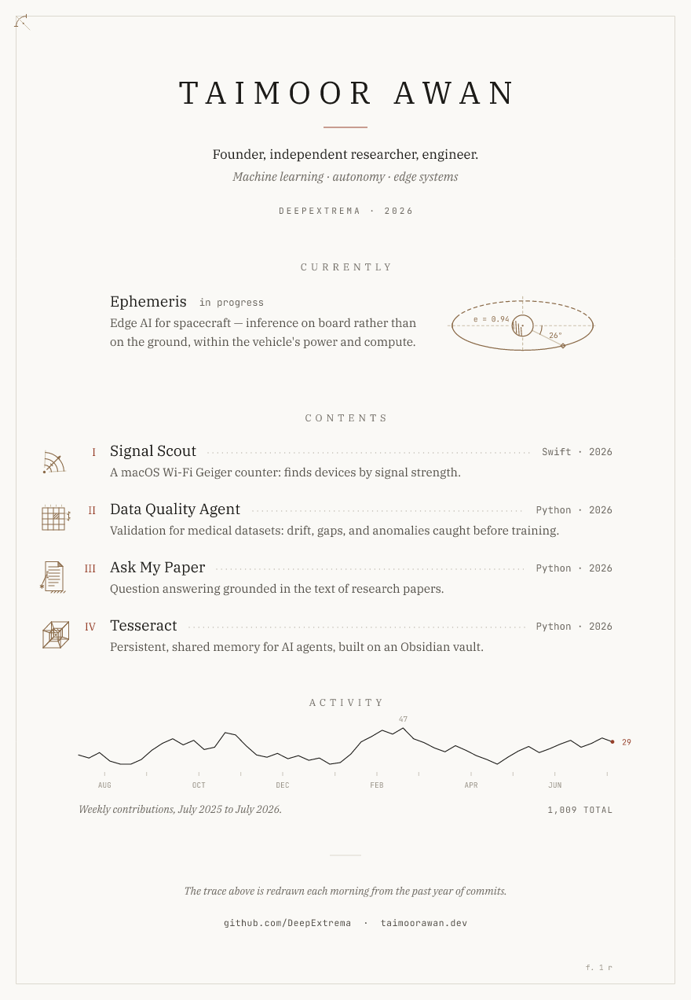
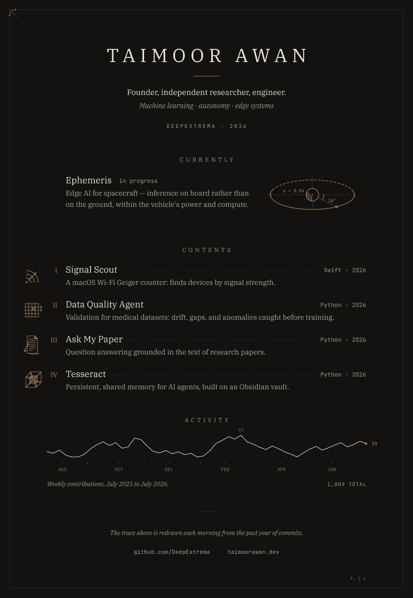

# The codex design

The profile page is set like the front matter of a finely made book that
has passed through a notebook-keeper's hands: a letterspaced title page, a
table of contents with leader dots, a year of work drawn as a single
hairline trace, and a closing colophon that states plainly how the page is
made — annotated throughout with hairline ink figures in the manner of a
Renaissance codex: an orbital construction beside the current work, a
marginal emblem beside each project (a signal fan, an inspected grid, a
bracketed folio, a wireframe tesseract), a compass mark in one corner.

| Light | Dark |
|---|---|
|  |  |

*(Previews rendered with fixture activity data; the shipped plates carry
live data once the daily Action has run.)*

## Principles

- **Concrete language.** Every line on the page is a checkable fact — no
  metaphors, no taglines. Project descriptions say what the thing does;
  the detail column carries the repository's real language and year.
- **One quietly-alive element.** The activity trace redraws daily from the
  contribution calendar and draws itself in once on load (SMIL, with the
  fully drawn state as the base attributes, so caches and static renderers
  show the finished line). Nothing else moves.
- **Paper, not theme.** Warm paper (`#FAF9F6`) with a near-black variant
  (`#131210`) that is deliberately warmer than GitHub's own dark background,
  so the hairline frame reads as a page edge. Served via `<picture>` +
  `prefers-color-scheme`.
- **Rubric red** (`#96402A` / `#C67A57`) appears exactly three times: the
  title rule, the contents numerals, and the current-week marker.
- **A second ink for the figures.** All drawings use a sepia ink
  (`#8A6A48` / `#A58466`) with faint construction lines, so text stays text
  and figures read as figures. Drawings may only carry annotations that are
  true of the drawing itself (the drawn ellipse's eccentricity, its
  constructed angle) — never invented measurements.

## Type

IBM Plex Serif (400, 400 italic, 500) and JetBrains Mono (400), embedded in
the SVGs as woff2 data URIs. Leader dots are positioned from real glyph
advance widths (`src/svg/metrics.js`), extracted once from the font files.

## What regenerates daily

Only the activity block: trace geometry, month ticks, the annotated max and
current week, the date-range caption, the total, and the imprint year.
Everything else is fixed by `profile.config.json`.

## Directions considered and set aside

Five directions were mocked up and scored by independent taste, novelty,
and feasibility reviews before this one was chosen:

- **Colophon (chosen)** — the only direction in every reviewer's top two.
- **Tufte data page** — the best typesetting of the set; lost on data
  dependency (needs per-repo commit series the pipeline doesn't fetch) and
  on per-repo sparklines reading close to existing "metrics" cards.
- **Engineer's ledger** — handsome deadpan register; weakest on mobile
  (dense 10px mono dissolves at 360px).
- **Swiss grid** — needs a true grotesk to work; with the available mono it
  reads as terminal aesthetic.
- **Radical plaintext** — bulletproof and native, but minimal profiles are
  themselves a recognized GitHub trope.
